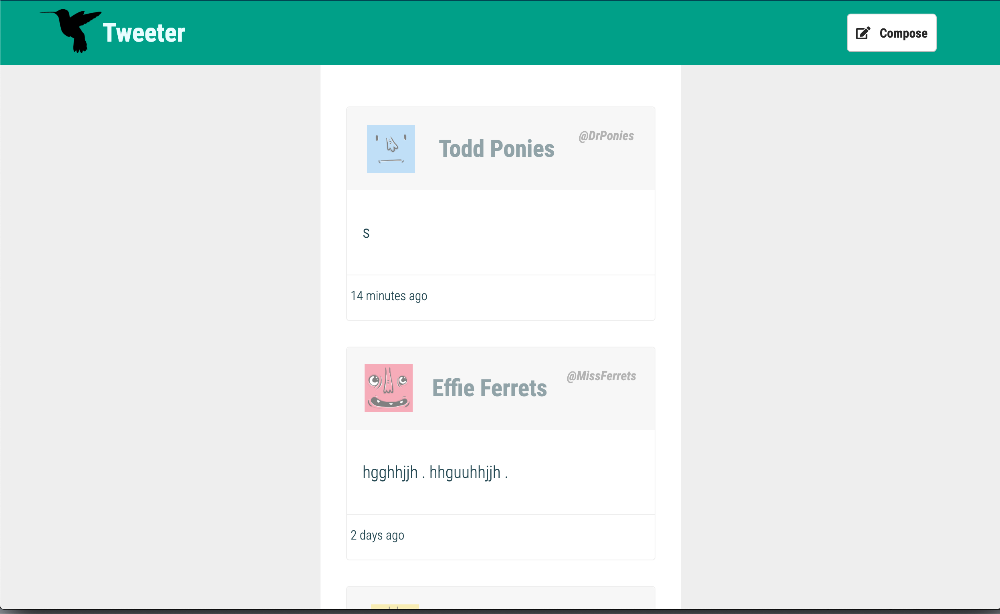
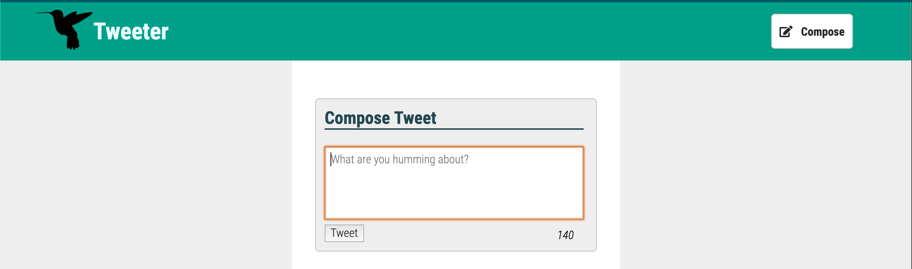
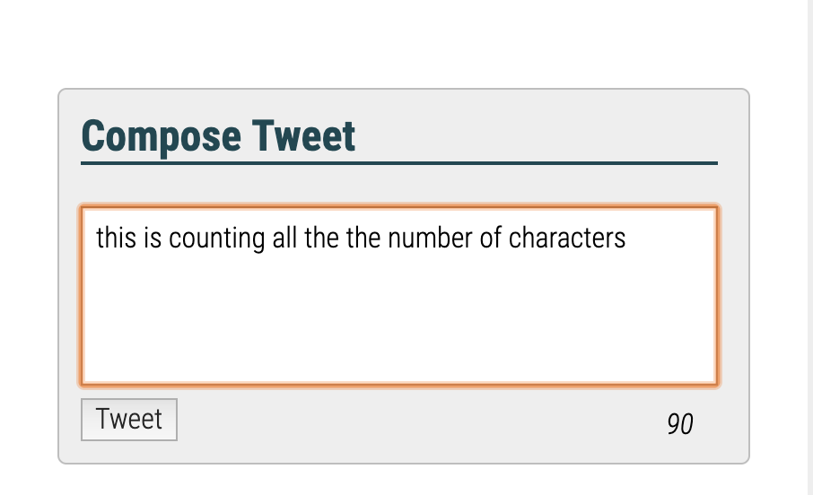
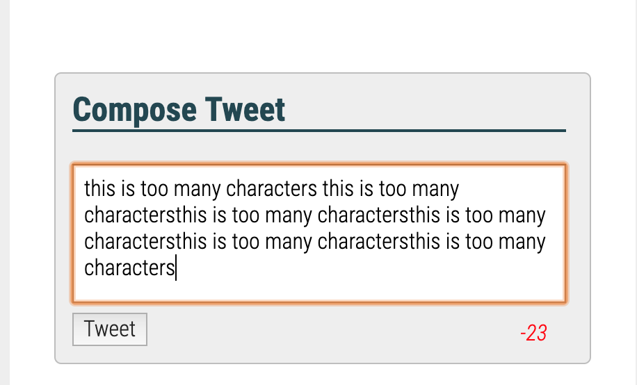
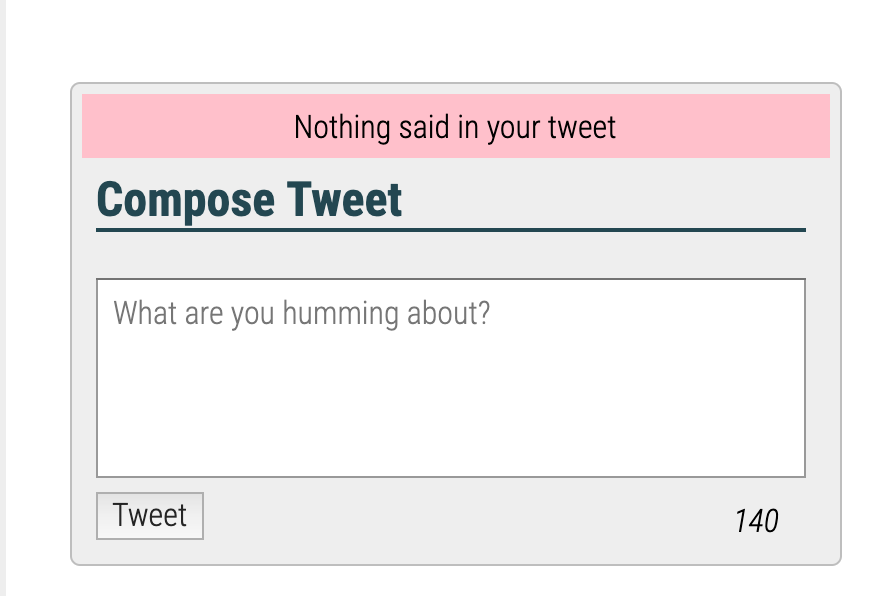

# Andrea's Tweeter Project

Tweeter is a simple, single-page Twitter clone.

## Getting Started

2. Install dependencies using the `npm install` command.
3. Start the web server using the `npm run local` command. The app will be served at <http://localhost:8080/>.
4. Go to <http://localhost:8080/> in your browser.

## Dependencies

- Express
- Node 5.10.x or above
- body-parser: ^1.15.2
- chance: ^1.0.2
- md5: ^2.1.0
- mongodb": ^3.2.3

## Final Product Screenshots

### Home page

### Compose New Tweets.

### Tweet Charc Counters.

### Error message for empty tweet or over 140 count.

